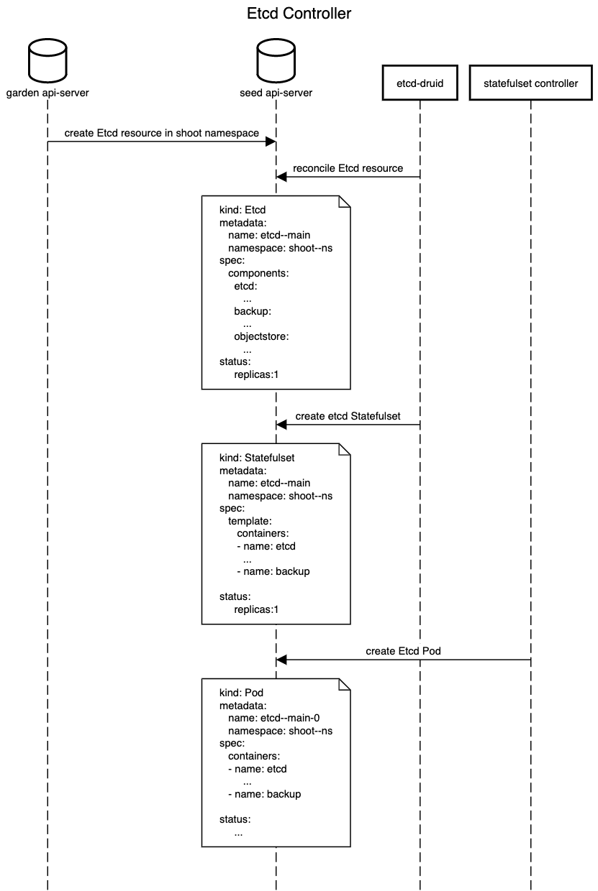

# ETCD Druid
## Background
[ETCD](https://github.com/etcd-io/etcd) in the control plane of Kubernetes clusters managed by Gardener is  deployed as a Statefulset. The statefulset has a replica of one pod having two containers namely, etcd and [backup-restore](https://github.com/gardener/etcd-backup-restore). Etcd container interfaces with the etcd-backup-restore before etcd startup via REST apis in a bash script to perform data validation. If the validation fails, the latest snapshot in the cloud-provider object-store is restored to the etcd directory. Once etcd has started, the etcd-backup-restore takes periodic full and delta snapshots. It performs periodic defragmentation of etcd data as well. 

The etcd-backup-restore requires as its input the cloud-provider information comprising of security credentials to access the object store, the object-store bucket name and prefix for the directory to push/pull snapshots. Currently, for operations like migration and validation, the bash script has to be updated to initiate the operation. 

## Goals
* Deploy etcd and etcd-backup-restore using an Etcd CRD.
* Support replicas for etcd greater than one.
* Perform scheduled snapshots.
* Support opertions such as restores, defrags and scaling with zero-downtime.
* Handle cloud-provider specific operation logic.
* Trigger a full backup on request before volume deletion.
* Offline compaction of full and delta snapshots in objectstore.

## Proposal
The existing method of deploying etcd and backup-sidecar as a StatefulSet alleviates the pain of ensuring the pods are live and ready after node crashes. However, deploying etcd as a Statefulset also brings a plethora of challenges. The etcd controller should be smart enough to handle etcd statefulsets taking into account limitations imposed by statefulsets. The controller shall update the status regarding how to target the K8s objects it has created. This field in the status can be leveraged by `HVPA` to scale the etcd resources eventually.

## CRD specification
The Etcd CRD should contain the information required to create the etcd and backup-restore sidecar in a pod/statefulset.
```yaml
--- 

apiVersion: druid.sapcloud.io/v1
kind: Etcd
metadata:
  annotations:
    kubectl.kubernetes.io/last-applied-configuration: |
      {"apiVersion":"druid.sapcloud.io/v1","kind":"Etcd","metadata":{"annotations":{},"labels":{"app":"etcd-statefulset","garden.sapcloud.io/role":"controlplane","role":"test"},"name":"test","namespace":"shoot--dev--i308301-1"},"spec":{"annotations":{"app":"etcd-statefulset","garden.sapcloud.io/role":"controlplane","networking.gardener.cloud/to-dns":"allowed","networking.gardener.cloud/to-private-networks":"allowed","networking.gardener.cloud/to-public-networks":"allowed","role":"test"},"backup":{"deltaSnapshotMemoryLimit":104857600,"deltaSnapshotPeriod":"300s","etcdConnectionTimeout":"300s","etcdQuotaBytes":8589934592,"fullSnapshotSchedule":"0 */24 * * *","garbageCollectionPeriod":"43200s","garbageCollectionPolicy":"Exponential","imageRepository":"eu.gcr.io/gardener-project/gardener/etcdbrctl","imageVersion":"0.8.0-dev","port":8080,"pullPolicy":"IfNotPresent","resources":{"limits":{"cpu":"500m","memory":"2Gi"},"requests":{"cpu":"23m","memory":"128Mi"}},"snapstoreTempDir":"/var/etcd/data/temp"},"etcd":{"clientPort":2379,"defragmentationSchedule":"0 */24 * * *","enableTLS":false,"imageRepository":"quay.io/coreos/etcd","imageVersion":"v3.3.13","initialClusterState":"new","initialClusterToken":"new","metrics":"basic","pullPolicy":"IfNotPresent","resources":{"limits":{"cpu":"2500m","memory":"4Gi"},"requests":{"cpu":"500m","memory":"1000Mi"}},"serverPort":2380,"storageCapacity":"80Gi","storageClass":"gardener.cloud-fast"},"labels":{"app":"etcd-statefulset","garden.sapcloud.io/role":"controlplane","networking.gardener.cloud/to-dns":"allowed","networking.gardener.cloud/to-private-networks":"allowed","networking.gardener.cloud/to-public-networks":"allowed","role":"test"},"pvcRetentionPolicy":"DeleteAll","replicas":1,"storageCapacity":"80Gi","storageClass":"gardener.cloud-fast","store":{"storageContainer":"shoot--dev--i308301-1--b3caa","storageProvider":"S3","storePrefix":"etcd-test","storeSecret":"etcd-backup"},"tlsClientSecret":"etcd-client-tls","tlsServerSecret":"etcd-server-tls"}}
  creationTimestamp: 2019-09-12T12:20:04Z
  finalizers:
  - druid.sapcloud.io/etcd-druid
  generation: 3
  labels:
    app: etcd-statefulset
    garden.sapcloud.io/role: controlplane
    role: test
  name: test
  namespace: shoot--dev--i308301-1
  resourceVersion: "75172656"
  selfLink: /apis/druid.sapcloud.io/v1/namespaces/shoot--dev--i308301-1/etcds/test
  uid: a6afc65f-d557-11e9-8ea7-469a1879b8a9
spec:
  annotations:
    app: etcd-statefulset
    garden.sapcloud.io/role: controlplane
    networking.gardener.cloud/to-dns: allowed
    networking.gardener.cloud/to-private-networks: allowed
    networking.gardener.cloud/to-public-networks: allowed
    role: test
  backup:
    deltaSnapshotMemoryLimit: 104857600
    deltaSnapshotPeriod: 300s
    etcdConnectionTimeout: 300s
    etcdQuotaBytes: 8589934592
    fullSnapshotSchedule: 0 */24 * * *
    garbageCollectionPeriod: 43200s
    garbageCollectionPolicy: Exponential
    imageRepository: eu.gcr.io/gardener-project/gardener/etcdbrctl
    imageVersion: 0.8.0-dev
    port: 8080
    pullPolicy: IfNotPresent
    resources:
      limits:
        cpu: 500m
        memory: 2Gi
      requests:
        cpu: 23m
        memory: 128Mi
    snapstoreTempDir: /var/etcd/data/temp
  etcd:
    clientPort: 2379
    defragmentationSchedule: 0 */24 * * *
    enableTLS: false
    imageRepository: quay.io/coreos/etcd
    imageVersion: v3.3.13
    initialClusterState: new
    initialClusterToken: new
    metrics: basic
    pullPolicy: IfNotPresent
    resources:
      limits:
        cpu: 2500m
        memory: 4Gi
      requests:
        cpu: 500m
        memory: 1000Mi
    serverPort: 2380
    storageCapacity: 80Gi
    storageClass: gardener.cloud-fast
  labels:
    app: etcd-statefulset
    garden.sapcloud.io/role: controlplane
    networking.gardener.cloud/to-dns: allowed
    networking.gardener.cloud/to-private-networks: allowed
    networking.gardener.cloud/to-public-networks: allowed
    role: test
  pvcRetentionPolicy: DeleteAll
  replicas: 1
  storageCapacity: 80Gi
  storageClass: gardener.cloud-fast
  store:
    storageContainer: test
    storageProvider: S3
    storePrefix: etcd-test
    storeSecret: etcd-backup
  tlsClientSecret: etcd-client-tls
  tlsServerSecret: etcd-server-tls
status:
  etcd:
    apiVersion: apps/v1
    kind: StatefulSet
    name: etcd-test
```

## Implementation Agenda
We shall target defragmentation during maintenence window as the first step. Subsequently, we shall attempt to perform zero-downtime upgrades and defragmentation.

## Workflow
### Deployment workflow

### Defragment workflow

